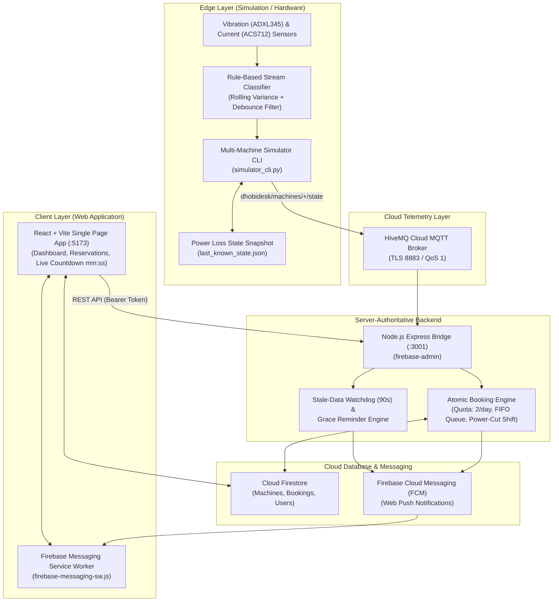

# DhobiDesk 🧺
> **IoT-Enabled Smart Laundry Machine Monitoring & Dynamic Booking System**

DhobiDesk is a full-stack, edge-to-cloud smart laundry management platform designed for student hostels and multi-user residential campuses. It uses sensor fusion (vibration and current sensing), lightweight rule-based state classification, cloud MQTT messaging, real-time Firestore database synchronization, and a modern responsive web application to deliver live machine availability, power-cut fault recovery, dynamic queue scheduling, and instant push notifications.

---

## 🏛 System Architecture

The following diagram illustrates the end-to-end data flow and system components:



---

## 🚀 Key Features

1. **Rule-Based Sensor Telemetry & Classification**:
   - Converts raw current and 3-axis accelerometer readings into machine states: `idle`, `washing`, `spinning`, `done`, and `offline`.
   - Incorporates a 5-sample debounce filter to eliminate false state transitions caused by momentary vibration spikes.
2. **Server-Authoritative Booking Engine (`/bridge`)**:
   - Built with Node.js and Express to replace Firebase Cloud Functions (completely avoiding Blaze plan requirements).
   - Enforces a daily booking quota of 2 cycles per student via atomic Firestore transactions.
   - Automatically promotes queued reservations when active cycles finish or are cancelled.
   - Detects stale/hung machines after 90 seconds of inactivity and transitions them to `offline`.
3. **Power-Cut Resilience & Dynamic Slot Shifting**:
   - If a machine loses power during an active wash cycle, the cycle is automatically flagged as `paused`, preserving the remaining milliseconds.
   - The web app prominently displays a `⏸ PAUSED (Power Cut)` banner.
   - When electricity is restored, completion time is dynamically shifted forward by the exact remaining runtime, and all downstream queued start times are automatically recalculated.
4. **Real Web Push Notifications (FCM & Service Worker)**:
   - Delivers instant notifications when a machine finishes, when a student is promoted to active, or when a power cut pauses/resumes a wash cycle.
   - Native background notifications handled by `/public/firebase-messaging-sw.js` alongside in-app dismissible toasts.
5. **Modern, Responsive Frontend (`/webapp`)**:
   - Adaptive dark and light theme styling.
   - Per-machine wait time estimations (e.g. `Available now` or `Queue: 2 • ~35m wait`).
   - Dedicated "My Reservations" workspace with live `mm:ss` countdown tickers and direct actions: **"Cancel Reservation"** and **"✓ I've Collected"**.

---

## ⚙️ Environment Configuration

DhobiDesk utilizes environment variables across each tier. Template `.env.example` files are provided in each directory.

### 1. Simulation (`simulation/.env`)
| Variable | Description | Example |
| :--- | :--- | :--- |
| `HIVEMQ_BROKER` | HiveMQ Cloud broker hostname | `4f4ca661...s1.eu.hivemq.cloud` |
| `HIVEMQ_PORT` | TLS broker port | `8883` |
| `HIVEMQ_USERNAME` | MQTT client username | `dhobidesk-device` |
| `HIVEMQ_PASSWORD` | MQTT client password | `your-hivemq-password` |
| `MACHINE_ID` | Default machine identifier | `machine_01` |

### 2. Bridge Backend (`bridge/.env`)
| Variable | Description | Example |
| :--- | :--- | :--- |
| `PORT` | Local Express server port | `3001` |
| `CORS_ORIGIN` | Allowed client origin | `http://localhost:5173` |
| `HIVEMQ_URL` | HiveMQ Cloud MQTT TLS URL | `mqtts://4f4ca661...s1.eu.hivemq.cloud:8883` |
| `HIVEMQ_USERNAME` | MQTT client username | `dhobidesk-device` |
| `HIVEMQ_PASSWORD` | MQTT client password | `your-hivemq-password` |
| `FIREBASE_SERVICE_ACCOUNT_PATH` | Path to service account JSON (optional) | `./serviceAccountKey.json` |
| `FIREBASE_SERVICE_ACCOUNT_KEY` | Inline service account JSON string (optional) | `{"type": "service_account", ...}` |

### 3. Web Application (`webapp/.env`)
| Variable | Description | Example |
| :--- | :--- | :--- |
| `VITE_FIREBASE_API_KEY` | Firebase Web API Key | `AIzaSy...` |
| `VITE_FIREBASE_AUTH_DOMAIN` | Firebase Auth Domain | `dhobidesk-jass-fyp.firebaseapp.com` |
| `VITE_FIREBASE_PROJECT_ID` | Firebase Project ID | `dhobidesk-jass-fyp` |
| `VITE_FIREBASE_STORAGE_BUCKET` | Firebase Storage Bucket | `dhobidesk-jass-fyp.firebasestorage.app` |
| `VITE_FIREBASE_MESSAGING_SENDER_ID` | FCM Messaging Sender ID | `1234567890` |
| `VITE_FIREBASE_APP_ID` | Firebase App ID | `1:1234567890:web:...` |
| `VITE_FIREBASE_VAPID_KEY` | Web Push Certificate (VAPID key) | `BJkX...` |
| `VITE_BRIDGE_URL` | Local Bridge API base URL | `http://localhost:3001` |

---

## 🛠 Local Setup & Quickstart Guide

### Prerequisites
- **Node.js**: v18.x or v20+ installed
- **Python**: 3.10+ installed
- **Firebase Project**: Firestore database created in test/production mode with Firebase Authentication (Email/Password) enabled.

---

### Step 1: Bridge Server Setup
In a new terminal window:
```powershell
cd bridge
npm install
node index.js
```
The bridge will initialize and listen on `http://localhost:3001`.

---

### Step 2: Web Application Setup
In a second terminal window:
```powershell
cd webapp
npm install
npm run dev
```
Open [`http://localhost:5173`](http://localhost:5173) in your browser.

---

### Step 3: Simulation & Telemetry Setup
In a third terminal window:
```powershell
cd simulation
# Create and activate virtual environment (if not already existing)
python -m venv venv
venv\Scripts\activate
pip install -r requirements.txt # or pip install paho-mqtt pandas numpy pytest

# Run multi-machine simulator with 5x speedup
python simulator_cli.py -n 2 --speedup 5.0
```

---

## 🧪 Automated Testing

### 1. Python Unit Tests (Pytest)
Validates sensor rolling variance, threshold calibration, stream debounce filtering, state persistence, and watchdog heartbeat timeouts:
```powershell
simulation\venv\Scripts\pytest.exe simulation/tests -v
```

### 2. Node.js Booking Engine Tests (Node Test Runner)
Validates atomic quota enforcement, daily reset behavior, FIFO queue position assignment, cancellation re-numbering, turn promotion, and dynamic timing formulas:
```powershell
cd bridge
npm test
```

---

## 📖 Further Documentation

- **[docs/DEMO_SCRIPT.md](file:///c:/Users/ATCHAYA%20S/Documents/Dhobidesk/docs/DEMO_SCRIPT.md)**: Comprehensive, step-by-step viva presentation script with live fault injection walkthroughs.
- **[docs/REPORT_NOTES.md](file:///c:/Users/ATCHAYA%20S/Documents/Dhobidesk/docs/REPORT_NOTES.md)**: Academic dissertation notes covering problem formulation, sensor modeling, mathematical timing recovery proofs, and security architecture.
